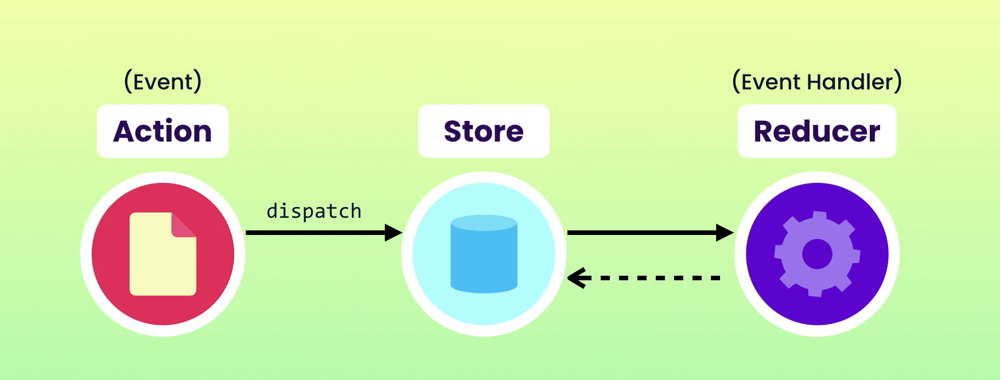
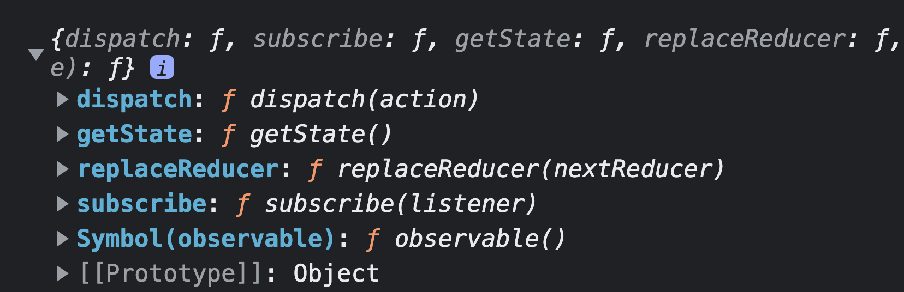
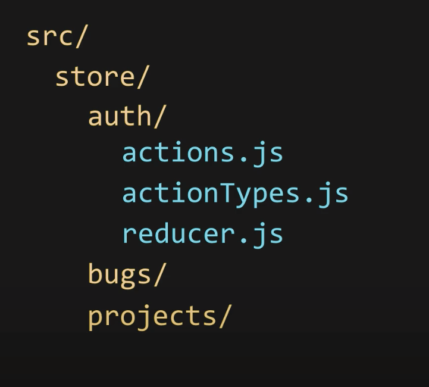
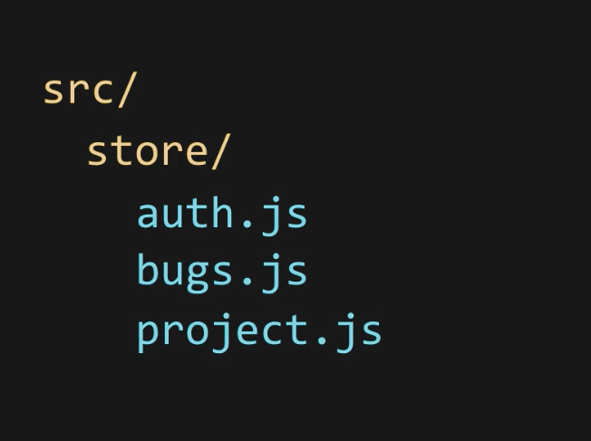

# Redux Architecture

These are the 3 building blocks of Redux:

* Actions  
* Store 
* Reducers

## Store

We store the application in a single JS object called the store.

The store is the single source of truth for the app state, and it is accessible for all the components.

Store example for an e-commerce:

```
{
    categories:[],
    products:[],
    cart:{},
    user:{}
}
```

We cannot mutate the state of the store, redux is based on functional programming.

The UI components can suscribe to the store to get notification of changes

## Reducers 

To update something in a store we need to create pure functions that takes the store as argument and return  a new instance of the updated store.

The reducer takes the store and returns a new instance of the store with udpated values.

A Reducer must be a pure function. We cannot do http calls inside a reducer, we must add a middleware

## Actions

How does the reduce knows which parts of the store to update? what is the new data?

* We need more inputs in our reducer functions, we called it an 'action', it just tell us what happend.

```
// inputs: initial state of the store and action to do
// output: new instance of the store updated

funciton reducer(store, action){
    const updated = {...store};
}
```

In the payload you can add data that you whant to use when updating the state

```
// action example
{
    type: 'addItem',
    payload:{
        id: 1
    }
}
```

In a real App a store can have many slices, we can create multiple reducers, and each reducer manages how to update the store.

We do not work with the reducer directly, we use the store, which calls the reducer. In that way we have a single entry point




## Steps to Create a Redux App

1. *Design the Store :* what data do we want to save in the store? how the data is going to look like?

2. *Define the Actions:* which actions can the users do with the store data? (like CRUD operations)

3. *Create Reducers:* functions that takes the actions and returns the updated state.

4. *Set up the store* based on our reducers.

---

## Simple Redux Demo

> Go to: /reducer-example-1

```
import store from "./reducer-example-1/store";

console.log(store);
```

This is a Store:



We have getState() but not setState() we can only change the state using dispatch(), in that way we can be sure we can only have one way to update the state by using our reducers

'dispatch' an action is the same as firing an event to the store, based on the 'type' redux knows to what reducer to route the action and there perform the update to the state.

```
store.dispatch({
  type: "bugAdded",
  payload: {
    description: "Bug 1",
  },
});

```

We can subscribe to store updates:

```
store.subscribe(() => {
  console.log("Store changed !", store.getState());
});
```

To look at some examples of functional programming:

> Go to: /functional

To know how to build a simple Redux lib from scratch:
> Go to: /build-reduxlib

---

## Clean Redux Code

Save your redux code in an orgnized directory tree.

Separate  your store by domains (auth, products, shoppingCart, etc). 

Each domain should have their actions, actionTypes and reducer



Some people like to combine all these 3 files togetther in just 1 .js file, that is called the 'Dux' pattern.
This structure is more maintainable



> Go to: /store-dux-pattern

---

## Redux ToolKit

Includes a lot of helper functions for simplifying redux code:

* Creating the store
* Dispatch Asynchronous Actions (like calling APIS, without need to create a manual middleware)
* Simplifies creation of ActionCreators and ActionTypes
* Create reducerws without 'switch' statements and with muttable-like code (implements immer ready-to-go)

> Go to: /using-reduxtoolkit 

---

# Middleware

Piece of code that is executed *after an action is dispatch* and *before it reaches the root reducer*, so it is in the middle.

Some kind of middleware:

* Calling APIs
* Error reporting
* Analytics
* Authorization

Everytime an action is dispatch, we can log it, or check if the user is authorize to do it, if is not authorized we can stop the proces there, so the action never gets to the reducer.

----
# Designing a Redux Store

> Go to src/using-reduxtoolkit/  to see a complete example with ReduxToolkit, Memoization, Middlewares and Selectors

## Redux State vs Local State
 
 Is it correct to have local state in our UI components? or do we have to put all the state logic in the redux store?

 If we store all the data in the redux store, we have:

 * Unified data access
 * Cacheability
 * Easier Debugging
 * More testable code

---

 Expection: Forms state

 We shouldn't store the state of a UI form being filled, because:

 * Forms have temporary values until the user submits the form
 * Too many dispatches (1 dispatch event per each keyboard type)
 * Harder debugging (we'll see 5000 actions dispatched just for keyboard events)

 *Probably we want to change the redux store state when the user submits the form, not just when he is filling the form.*

Use local state when it makes sense


## Structuring a Redux Store

Probably in lots of scenarios using a Map instead of an Array is a better idea.

With maps we have quick look ups for an object given its id.

In our example we can find a Bug or a Project whith its id using a map.

```
{
    1: {
        id: 1,
        description:"bug 1",
        resolved: false
        },
    2: {
        id: 2,
        description:"bug 2",
        resolved: true
        }
}
```

Maps doesn't preserver order. If the user sorts the list of bugs, we'll not be able to change the order of the properties in the object. **Always look at the problem you want to solve**.

**We can also use a combination of Maps and Arrays !:**

```
{
    byId:{
        1: {
            id: 1,
            description:"bug 1",
            resolved: false
            },
        2: {
            id: 2,
            description:"bug 2",
            resolved: true
            }
        3: {
            id: 3,
            description:"bug 3",
            resolved: true
            }
    },
    allIds:[3,1,2]  
}
```

allIds represent the order of the items in case the user wants to sort them

## Ideas to structure the Store:

* Create multiple slices for each entity in your app

```
{
    bugs: [],
    projects:[],
    tags:[]
}
```

* Put all entities in a parent slice

```
{
    entities: {
                bugs: [],
                projects:[],
                tags:[]
              }
}
```

* Store global user data


```
{
    entities: {
                bugs: [],
                projects:[],
                tags:[]
              },
    auth: {
        userId: 1,
        name: 'Jhon',
        token: 'etc1kkskxk'
    }
}
```

* Create a separate space to store User Interface State data:

For example if we want to add sort and filter functionality for our bugs list:

```
{
    entities: {
                bugs: [],
                projects:[],
                tags:[]
              },
    auth: {
        userId: 1,
        name: 'Jhon',
        token: 'etc1kkskxk'
    },
    ui: {
        bugs:{
            query: '....',
            sortBy: '...'
        }
    }
}
```

## Combining Reducers

We can use combineReducer() funciton from Redux to combine multiple slices/reducers. 

When we dispatch an action, each node in the reduceres tree pass the action to its children -> so in redux multiple reducers can handle the same action.

Each reducer is responsible for updating a slice of the hole store state.

<image src="./images/combiningReducers.png" width="50%"/>

## Normalization

**We should not duplicate data in our store**

Let's say our Bugs objects have a 'project' name field, and we also have an entity called Projects, so if the user updates the project name, we'll need to update it in every place.

<image src="./images/notNormalizedStore.png" width="50%"/>

In this case we need to normalize the data and replace the project object inside our bugs list, with a project id

<image src="./images/normalized.png" width="50%"/>

**What if we are consuming an external API that provide us de-normalized data?**

We can use libraries like *normalizr* to normalize the data, which is very easy to use.

## Selectors

When we want to consume data from our store we can use selector to quickly get a slice of our store.